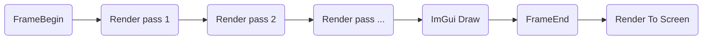
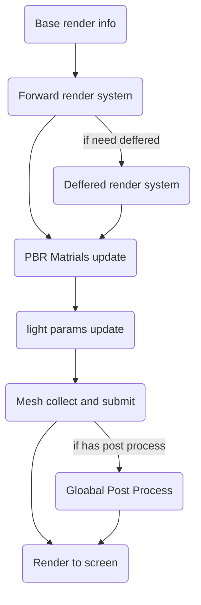

# Renderer

## Frame flow

So far the render flow for 1 object, still in a very noobie ways, seems just like this

this is the most easy way and the fastest way to code, but waste lots of draw call

so the plan to change this part frame flow, now it should be like

* BaseRenderInfo
  * Camera info update
* Forward render system update
* PBR system update
* Light system update
* Mesh collect and merge
  * collect all meshes and transfer to command list
  * merge all command to 1 upload
* post process
* blit to screen frame 

