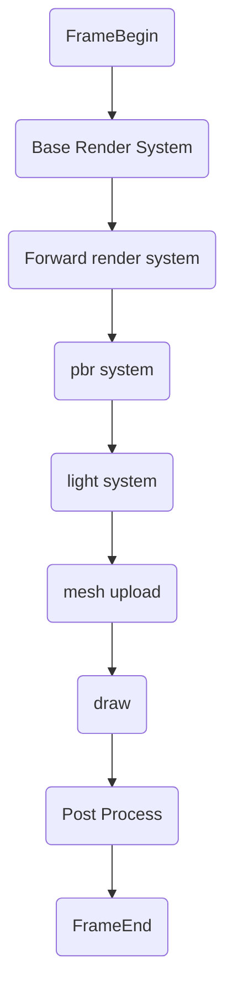

# Renderer Design

-----------------

## Frame flow

* BaseRender Info
* ForwardRenderer system update
* PBR system binding
* light system update
* mesh submit
* render to screen

```mermaid
graph TB
   Begin(FrameBegin)
   End(FrameEnd)
   Base(Base Render System )
   Forward(Forward render system)
   pbr(pbr system)
   light(light system)
   mesh(mesh upload)
   pp(Post Process)
   render(draw)

   Begin-->Base

   Base-->Forward

   Forward-->pbr

   pbr-->light
   light-->mesh
   mesh-->render
   render-->pp

    pp-->End


```
